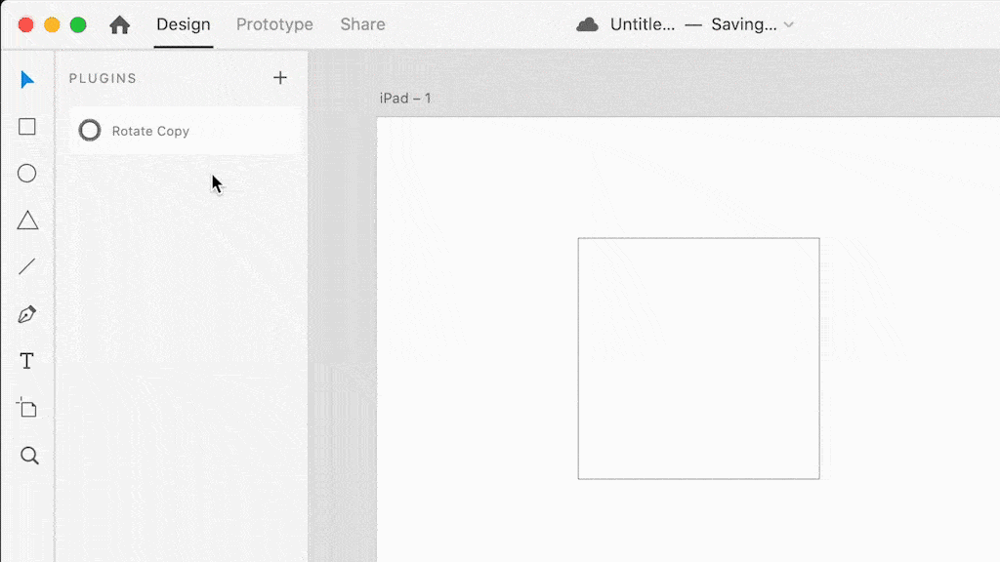

# rotateCopy



This plugin allows you to rotate and copy any shape based on your angle of selection.

## Setup

```bash
npm install
```

## Deploy plugin to `Develop` folder

Deploy the plugin and monitor updates of files.

```bash
npm start
```

## Usage

1. Reload plugins: `Plugins` > `Development` > `Reload Plugins` or press `shift + command(ctrl) + R` keys.
2. Run the plugin: `Plugins` > `rotateCopy`
